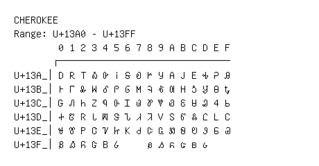

# Cherokee

**Range:** `U+13A0` - `U+13FF`

[← Back to Index](../README.md)

```text
        0 1 2 3 4 5 6 7 8 9 A B C D E F
       ┌───────────────────────────────
U+13A_│Ꭰ Ꭱ Ꭲ Ꭳ Ꭴ Ꭵ Ꭶ Ꭷ Ꭸ Ꭹ Ꭺ Ꭻ Ꭼ Ꭽ Ꭾ Ꭿ
U+13B_│Ꮀ Ꮁ Ꮂ Ꮃ Ꮄ Ꮅ Ꮆ Ꮇ Ꮈ Ꮉ Ꮊ Ꮋ Ꮌ Ꮍ Ꮎ Ꮏ
U+13C_│Ꮐ Ꮑ Ꮒ Ꮓ Ꮔ Ꮕ Ꮖ Ꮗ Ꮘ Ꮙ Ꮚ Ꮛ Ꮜ Ꮝ Ꮞ Ꮟ
U+13D_│Ꮠ Ꮡ Ꮢ Ꮣ Ꮤ Ꮥ Ꮦ Ꮧ Ꮨ Ꮩ Ꮪ Ꮫ Ꮬ Ꮭ Ꮮ Ꮯ
U+13E_│Ꮰ Ꮱ Ꮲ Ꮳ Ꮴ Ꮵ Ꮶ Ꮷ Ꮸ Ꮹ Ꮺ Ꮻ Ꮼ Ꮽ Ꮾ Ꮿ
U+13F_│Ᏸ Ᏹ Ᏺ Ᏻ Ᏼ Ᏽ     ᏸ ᏹ ᏺ ᏻ ᏼ ᏽ
```

## Visual Fallback Reference
If your system lacks the required fonts to render these characters properly, use the image below as a visual guide.


