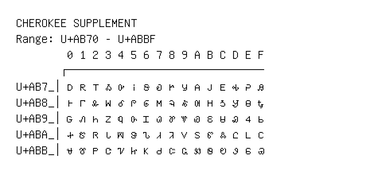

# Cherokee Supplement

**Range:** `U+AB70` - `U+ABBF`

[← Back to Index](../README.md)

```text
        0 1 2 3 4 5 6 7 8 9 A B C D E F
       ┌───────────────────────────────
U+AB7_│ꭰ ꭱ ꭲ ꭳ ꭴ ꭵ ꭶ ꭷ ꭸ ꭹ ꭺ ꭻ ꭼ ꭽ ꭾ ꭿ
U+AB8_│ꮀ ꮁ ꮂ ꮃ ꮄ ꮅ ꮆ ꮇ ꮈ ꮉ ꮊ ꮋ ꮌ ꮍ ꮎ ꮏ
U+AB9_│ꮐ ꮑ ꮒ ꮓ ꮔ ꮕ ꮖ ꮗ ꮘ ꮙ ꮚ ꮛ ꮜ ꮝ ꮞ ꮟ
U+ABA_│ꮠ ꮡ ꮢ ꮣ ꮤ ꮥ ꮦ ꮧ ꮨ ꮩ ꮪ ꮫ ꮬ ꮭ ꮮ ꮯ
U+ABB_│ꮰ ꮱ ꮲ ꮳ ꮴ ꮵ ꮶ ꮷ ꮸ ꮹ ꮺ ꮻ ꮼ ꮽ ꮾ ꮿ
```

## Visual Fallback Reference
If your system lacks the required fonts to render these characters properly, use the image below as a visual guide.


