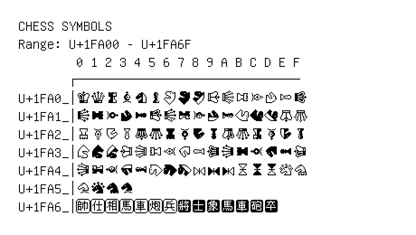

# Chess Symbols

**Range:** `U+1FA00` - `U+1FA6F`

[← Back to Index](../README.md)

```text
        0 1 2 3 4 5 6 7 8 9 A B C D E F
       ┌───────────────────────────────
U+1FA0_│🨀 🨁 🨂 🨃 🨄 🨅 🨆 🨇 🨈 🨉 🨊 🨋 🨌 🨍 🨎 🨏
U+1FA1_│🨐 🨑 🨒 🨓 🨔 🨕 🨖 🨗 🨘 🨙 🨚 🨛 🨜 🨝 🨞 🨟
U+1FA2_│🨠 🨡 🨢 🨣 🨤 🨥 🨦 🨧 🨨 🨩 🨪 🨫 🨬 🨭 🨮 🨯
U+1FA3_│🨰 🨱 🨲 🨳 🨴 🨵 🨶 🨷 🨸 🨹 🨺 🨻 🨼 🨽 🨾 🨿
U+1FA4_│🩀 🩁 🩂 🩃 🩄 🩅 🩆 🩇 🩈 🩉 🩊 🩋 🩌 🩍 🩎 🩏
U+1FA5_│🩐 🩑 🩒 🩓
U+1FA6_│🩠 🩡 🩢 🩣 🩤 🩥 🩦 🩧 🩨 🩩 🩪 🩫 🩬 🩭
```

## Visual Fallback Reference
If your system lacks the required fonts to render these characters properly, use the image below as a visual guide.


