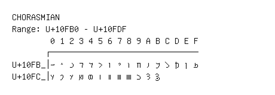

# Chorasmian

**Range:** `U+10FB0` - `U+10FDF`

[← Back to Index](../README.md)

```text
        0 1 2 3 4 5 6 7 8 9 A B C D E F
       ┌───────────────────────────────
U+10FB_│𐾰 𐾱 𐾲 𐾳 𐾴 𐾵 𐾶 𐾷 𐾸 𐾹 𐾺 𐾻 𐾼 𐾽 𐾾 𐾿
U+10FC_│𐿀 𐿁 𐿂 𐿃 𐿄 𐿅 𐿆 𐿇 𐿈 𐿉 𐿊 𐿋
```

## Visual Fallback Reference
If your system lacks the required fonts to render these characters properly, use the image below as a visual guide.


