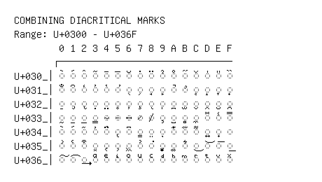

# Combining Diacritical Marks

**Range:** `U+0300` - `U+036F`

[← Back to Index](../README.md)

```text
        0 1 2 3 4 5 6 7 8 9 A B C D E F
       ┌───────────────────────────────
U+030_│◌̀ ◌́ ◌̂ ◌̃ ◌̄ ◌̅ ◌̆ ◌̇ ◌̈ ◌̉ ◌̊ ◌̋ ◌̌ ◌̍ ◌̎ ◌̏
U+031_│◌̐ ◌̑ ◌̒ ◌̓ ◌̔ ◌̕ ◌̖ ◌̗ ◌̘ ◌̙ ◌̚ ◌̛ ◌̜ ◌̝ ◌̞ ◌̟
U+032_│◌̠ ◌̡ ◌̢ ◌̣ ◌̤ ◌̥ ◌̦ ◌̧ ◌̨ ◌̩ ◌̪ ◌̫ ◌̬ ◌̭ ◌̮ ◌̯
U+033_│◌̰ ◌̱ ◌̲ ◌̳ ◌̴ ◌̵ ◌̶ ◌̷ ◌̸ ◌̹ ◌̺ ◌̻ ◌̼ ◌̽ ◌̾ ◌̿
U+034_│◌̀ ◌́ ◌͂ ◌̓ ◌̈́ ◌ͅ ◌͆ ◌͇ ◌͈ ◌͉ ◌͊ ◌͋ ◌͌ ◌͍ ◌͎ ◌͏
U+035_│◌͐ ◌͑ ◌͒ ◌͓ ◌͔ ◌͕ ◌͖ ◌͗ ◌͘ ◌͙ ◌͚ ◌͛ ◌͜ ◌͝ ◌͞ ◌͟
U+036_│◌͠ ◌͡ ◌͢ ◌ͣ ◌ͤ ◌ͥ ◌ͦ ◌ͧ ◌ͨ ◌ͩ ◌ͪ ◌ͫ ◌ͬ ◌ͭ ◌ͮ ◌ͯ
```

## Visual Fallback Reference
If your system lacks the required fonts to render these characters properly, use the image below as a visual guide.


