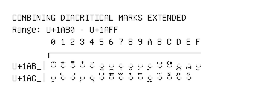

# Combining Diacritical Marks Extended

**Range:** `U+1AB0` - `U+1AFF`

[← Back to Index](../README.md)

```text
        0 1 2 3 4 5 6 7 8 9 A B C D E F
       ┌───────────────────────────────
U+1AB_│◌᪰ ◌᪱ ◌᪲ ◌᪳ ◌᪴ ◌᪵ ◌᪶ ◌᪷ ◌᪸ ◌᪹ ◌᪺ ◌᪻ ◌᪼ ◌᪽ ◌᪾ ◌ᪿ
U+1AC_│◌ᫀ ◌᫁ ◌᫂ ◌᫃ ◌᫄ ◌᫅ ◌᫆ ◌᫇ ◌᫈ ◌᫉ ◌᫊ ◌᫋ ◌ᫌ ◌ᫍ ◌ᫎ
```

## Visual Fallback Reference
If your system lacks the required fonts to render these characters properly, use the image below as a visual guide.


