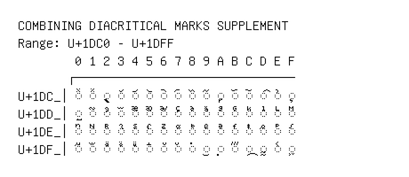

# Combining Diacritical Marks Supplement

**Range:** `U+1DC0` - `U+1DFF`

[← Back to Index](../README.md)

```text
        0 1 2 3 4 5 6 7 8 9 A B C D E F
       ┌───────────────────────────────
U+1DC_│◌᷀ ◌᷁ ◌᷂ ◌᷃ ◌᷄ ◌᷅ ◌᷆ ◌᷇ ◌᷈ ◌᷉ ◌᷊ ◌᷋ ◌᷌ ◌᷍ ◌᷎ ◌᷏
U+1DD_│◌᷐ ◌᷑ ◌᷒ ◌ᷓ ◌ᷔ ◌ᷕ ◌ᷖ ◌ᷗ ◌ᷘ ◌ᷙ ◌ᷚ ◌ᷛ ◌ᷜ ◌ᷝ ◌ᷞ ◌ᷟ
U+1DE_│◌ᷠ ◌ᷡ ◌ᷢ ◌ᷣ ◌ᷤ ◌ᷥ ◌ᷦ ◌ᷧ ◌ᷨ ◌ᷩ ◌ᷪ ◌ᷫ ◌ᷬ ◌ᷭ ◌ᷮ ◌ᷯ
U+1DF_│◌ᷰ ◌ᷱ ◌ᷲ ◌ᷳ ◌ᷴ ◌᷵ ◌᷶ ◌᷷ ◌᷸ ◌᷹ ◌᷺ ◌᷻ ◌᷼ ◌᷽ ◌᷾ ◌᷿
```

## Visual Fallback Reference
If your system lacks the required fonts to render these characters properly, use the image below as a visual guide.


