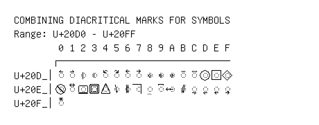

# Combining Diacritical Marks for Symbols

**Range:** `U+20D0` - `U+20FF`

[← Back to Index](../README.md)

```text
        0 1 2 3 4 5 6 7 8 9 A B C D E F
       ┌───────────────────────────────
U+20D_│◌⃐ ◌⃑ ◌⃒ ◌⃓ ◌⃔ ◌⃕ ◌⃖ ◌⃗ ◌⃘ ◌⃙ ◌⃚ ◌⃛ ◌⃜ ◌⃝ ◌⃞ ◌⃟
U+20E_│◌⃠ ◌⃡ ◌⃢ ◌⃣ ◌⃤ ◌⃥ ◌⃦ ◌⃧ ◌⃨ ◌⃩ ◌⃪ ◌⃫ ◌⃬ ◌⃭ ◌⃮ ◌⃯
U+20F_│◌⃰
```

## Visual Fallback Reference
If your system lacks the required fonts to render these characters properly, use the image below as a visual guide.


