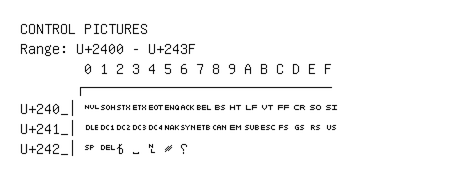

# Control Pictures

**Range:** `U+2400` - `U+243F`

[← Back to Index](../README.md)

```text
        0 1 2 3 4 5 6 7 8 9 A B C D E F
       ┌───────────────────────────────
U+240_│␀ ␁ ␂ ␃ ␄ ␅ ␆ ␇ ␈ ␉ ␊ ␋ ␌ ␍ ␎ ␏
U+241_│␐ ␑ ␒ ␓ ␔ ␕ ␖ ␗ ␘ ␙ ␚ ␛ ␜ ␝ ␞ ␟
U+242_│␠ ␡ ␢ ␣ ␤ ␥ ␦
```

## Visual Fallback Reference
If your system lacks the required fonts to render these characters properly, use the image below as a visual guide.


