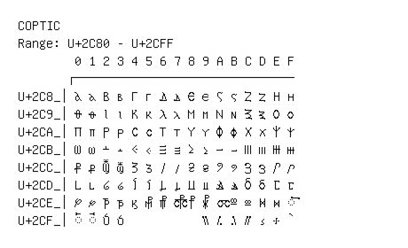

# Coptic

**Range:** `U+2C80` - `U+2CFF`

[← Back to Index](../README.md)

```text
        0 1 2 3 4 5 6 7 8 9 A B C D E F
       ┌───────────────────────────────
U+2C8_│Ⲁ ⲁ Ⲃ ⲃ Ⲅ ⲅ Ⲇ ⲇ Ⲉ ⲉ Ⲋ ⲋ Ⲍ ⲍ Ⲏ ⲏ
U+2C9_│Ⲑ ⲑ Ⲓ ⲓ Ⲕ ⲕ Ⲗ ⲗ Ⲙ ⲙ Ⲛ ⲛ Ⲝ ⲝ Ⲟ ⲟ
U+2CA_│Ⲡ ⲡ Ⲣ ⲣ Ⲥ ⲥ Ⲧ ⲧ Ⲩ ⲩ Ⲫ ⲫ Ⲭ ⲭ Ⲯ ⲯ
U+2CB_│Ⲱ ⲱ Ⲳ ⲳ Ⲵ ⲵ Ⲷ ⲷ Ⲹ ⲹ Ⲻ ⲻ Ⲽ ⲽ Ⲿ ⲿ
U+2CC_│Ⳁ ⳁ Ⳃ ⳃ Ⳅ ⳅ Ⳇ ⳇ Ⳉ ⳉ Ⳋ ⳋ Ⳍ ⳍ Ⳏ ⳏ
U+2CD_│Ⳑ ⳑ Ⳓ ⳓ Ⳕ ⳕ Ⳗ ⳗ Ⳙ ⳙ Ⳛ ⳛ Ⳝ ⳝ Ⳟ ⳟ
U+2CE_│Ⳡ ⳡ Ⳣ ⳣ ⳤ ⳥ ⳦ ⳧ ⳨ ⳩ ⳪ Ⳬ ⳬ Ⳮ ⳮ ◌⳯
U+2CF_│◌⳰ ◌⳱ Ⳳ ⳳ           ⳹ ⳺ ⳻ ⳼ ⳽ ⳾ ⳿
```

## Visual Fallback Reference
If your system lacks the required fonts to render these characters properly, use the image below as a visual guide.


