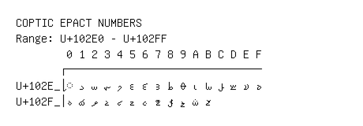

# Coptic Epact Numbers

**Range:** `U+102E0` - `U+102FF`

[← Back to Index](../README.md)

```text
        0 1 2 3 4 5 6 7 8 9 A B C D E F
       ┌───────────────────────────────
U+102E_│◌𐋠 𐋡 𐋢 𐋣 𐋤 𐋥 𐋦 𐋧 𐋨 𐋩 𐋪 𐋫 𐋬 𐋭 𐋮 𐋯
U+102F_│𐋰 𐋱 𐋲 𐋳 𐋴 𐋵 𐋶 𐋷 𐋸 𐋹 𐋺 𐋻
```

## Visual Fallback Reference
If your system lacks the required fonts to render these characters properly, use the image below as a visual guide.


