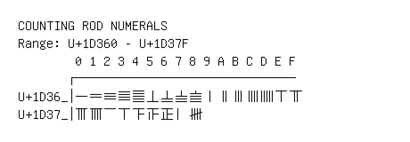

# Counting Rod Numerals

**Range:** `U+1D360` - `U+1D37F`

[← Back to Index](../README.md)

```text
        0 1 2 3 4 5 6 7 8 9 A B C D E F
       ┌───────────────────────────────
U+1D36_│𝍠 𝍡 𝍢 𝍣 𝍤 𝍥 𝍦 𝍧 𝍨 𝍩 𝍪 𝍫 𝍬 𝍭 𝍮 𝍯
U+1D37_│𝍰 𝍱 𝍲 𝍳 𝍴 𝍵 𝍶 𝍷 𝍸
```

## Visual Fallback Reference
If your system lacks the required fonts to render these characters properly, use the image below as a visual guide.


