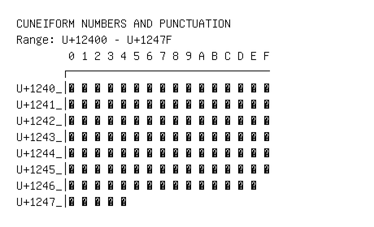

# Cuneiform Numbers and Punctuation

**Range:** `U+12400` - `U+1247F`

[← Back to Index](../README.md)

```text
        0 1 2 3 4 5 6 7 8 9 A B C D E F
       ┌───────────────────────────────
U+1240_│𒐀 𒐁 𒐂 𒐃 𒐄 𒐅 𒐆 𒐇 𒐈 𒐉 𒐊 𒐋 𒐌 𒐍 𒐎 𒐏
U+1241_│𒐐 𒐑 𒐒 𒐓 𒐔 𒐕 𒐖 𒐗 𒐘 𒐙 𒐚 𒐛 𒐜 𒐝 𒐞 𒐟
U+1242_│𒐠 𒐡 𒐢 𒐣 𒐤 𒐥 𒐦 𒐧 𒐨 𒐩 𒐪 𒐫 𒐬 𒐭 𒐮 𒐯
U+1243_│𒐰 𒐱 𒐲 𒐳 𒐴 𒐵 𒐶 𒐷 𒐸 𒐹 𒐺 𒐻 𒐼 𒐽 𒐾 𒐿
U+1244_│𒑀 𒑁 𒑂 𒑃 𒑄 𒑅 𒑆 𒑇 𒑈 𒑉 𒑊 𒑋 𒑌 𒑍 𒑎 𒑏
U+1245_│𒑐 𒑑 𒑒 𒑓 𒑔 𒑕 𒑖 𒑗 𒑘 𒑙 𒑚 𒑛 𒑜 𒑝 𒑞 𒑟
U+1246_│𒑠 𒑡 𒑢 𒑣 𒑤 𒑥 𒑦 𒑧 𒑨 𒑩 𒑪 𒑫 𒑬 𒑭 𒑮
U+1247_│𒑰 𒑱 𒑲 𒑳 𒑴
```

## Visual Fallback Reference
If your system lacks the required fonts to render these characters properly, use the image below as a visual guide.


