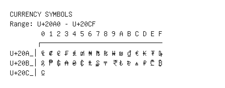

# Currency Symbols

**Range:** `U+20A0` - `U+20CF`

[← Back to Index](../README.md)

```text
        0 1 2 3 4 5 6 7 8 9 A B C D E F
       ┌───────────────────────────────
U+20A_│₠ ₡ ₢ ₣ ₤ ₥ ₦ ₧ ₨ ₩ ₪ ₫ € ₭ ₮ ₯
U+20B_│₰ ₱ ₲ ₳ ₴ ₵ ₶ ₷ ₸ ₹ ₺ ₻ ₼ ₽ ₾ ₿
U+20C_│⃀
```

## Visual Fallback Reference
If your system lacks the required fonts to render these characters properly, use the image below as a visual guide.


