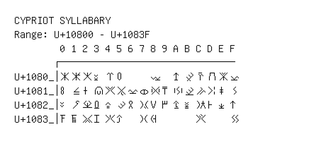

# Cypriot Syllabary

**Range:** `U+10800` - `U+1083F`

[← Back to Index](../README.md)

```text
        0 1 2 3 4 5 6 7 8 9 A B C D E F
       ┌───────────────────────────────
U+1080_│𐠀 𐠁 𐠂 𐠃 𐠄 𐠅     𐠈   𐠊 𐠋 𐠌 𐠍 𐠎 𐠏
U+1081_│𐠐 𐠑 𐠒 𐠓 𐠔 𐠕 𐠖 𐠗 𐠘 𐠙 𐠚 𐠛 𐠜 𐠝 𐠞 𐠟
U+1082_│𐠠 𐠡 𐠢 𐠣 𐠤 𐠥 𐠦 𐠧 𐠨 𐠩 𐠪 𐠫 𐠬 𐠭 𐠮 𐠯
U+1083_│𐠰 𐠱 𐠲 𐠳 𐠴 𐠵   𐠷 𐠸       𐠼     𐠿
```

## Visual Fallback Reference
If your system lacks the required fonts to render these characters properly, use the image below as a visual guide.


