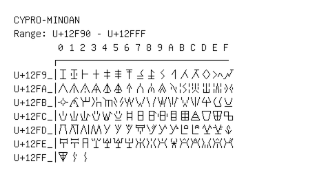

# Cypro-Minoan

**Range:** `U+12F90` - `U+12FFF`

[← Back to Index](../README.md)

```text
        0 1 2 3 4 5 6 7 8 9 A B C D E F
       ┌───────────────────────────────
U+12F9_│𒾐 𒾑 𒾒 𒾓 𒾔 𒾕 𒾖 𒾗 𒾘 𒾙 𒾚 𒾛 𒾜 𒾝 𒾞 𒾟
U+12FA_│𒾠 𒾡 𒾢 𒾣 𒾤 𒾥 𒾦 𒾧 𒾨 𒾩 𒾪 𒾫 𒾬 𒾭 𒾮 𒾯
U+12FB_│𒾰 𒾱 𒾲 𒾳 𒾴 𒾵 𒾶 𒾷 𒾸 𒾹 𒾺 𒾻 𒾼 𒾽 𒾾 𒾿
U+12FC_│𒿀 𒿁 𒿂 𒿃 𒿄 𒿅 𒿆 𒿇 𒿈 𒿉 𒿊 𒿋 𒿌 𒿍 𒿎 𒿏
U+12FD_│𒿐 𒿑 𒿒 𒿓 𒿔 𒿕 𒿖 𒿗 𒿘 𒿙 𒿚 𒿛 𒿜 𒿝 𒿞 𒿟
U+12FE_│𒿠 𒿡 𒿢 𒿣 𒿤 𒿥 𒿦 𒿧 𒿨 𒿩 𒿪 𒿫 𒿬 𒿭 𒿮 𒿯
U+12FF_│𒿰 𒿱 𒿲
```

## Visual Fallback Reference
If your system lacks the required fonts to render these characters properly, use the image below as a visual guide.


