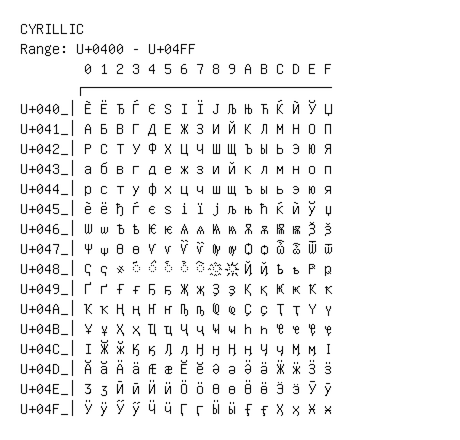

# Cyrillic

**Range:** `U+0400` - `U+04FF`

[← Back to Index](../README.md)

```text
        0 1 2 3 4 5 6 7 8 9 A B C D E F
       ┌───────────────────────────────
U+040_│Ѐ Ё Ђ Ѓ Є Ѕ І Ї Ј Љ Њ Ћ Ќ Ѝ Ў Џ
U+041_│А Б В Г Д Е Ж З И Й К Л М Н О П
U+042_│Р С Т У Ф Х Ц Ч Ш Щ Ъ Ы Ь Э Ю Я
U+043_│а б в г д е ж з и й к л м н о п
U+044_│р с т у ф х ц ч ш щ ъ ы ь э ю я
U+045_│ѐ ё ђ ѓ є ѕ і ї ј љ њ ћ ќ ѝ ў џ
U+046_│Ѡ ѡ Ѣ ѣ Ѥ ѥ Ѧ ѧ Ѩ ѩ Ѫ ѫ Ѭ ѭ Ѯ ѯ
U+047_│Ѱ ѱ Ѳ ѳ Ѵ ѵ Ѷ ѷ Ѹ ѹ Ѻ ѻ Ѽ ѽ Ѿ ѿ
U+048_│Ҁ ҁ ҂ ◌҃ ◌҄ ◌҅ ◌҆ ◌҇ ◌҈ ◌҉ Ҋ ҋ Ҍ ҍ Ҏ ҏ
U+049_│Ґ ґ Ғ ғ Ҕ ҕ Җ җ Ҙ ҙ Қ қ Ҝ ҝ Ҟ ҟ
U+04A_│Ҡ ҡ Ң ң Ҥ ҥ Ҧ ҧ Ҩ ҩ Ҫ ҫ Ҭ ҭ Ү ү
U+04B_│Ұ ұ Ҳ ҳ Ҵ ҵ Ҷ ҷ Ҹ ҹ Һ һ Ҽ ҽ Ҿ ҿ
U+04C_│Ӏ Ӂ ӂ Ӄ ӄ Ӆ ӆ Ӈ ӈ Ӊ ӊ Ӌ ӌ Ӎ ӎ ӏ
U+04D_│Ӑ ӑ Ӓ ӓ Ӕ ӕ Ӗ ӗ Ә ә Ӛ ӛ Ӝ ӝ Ӟ ӟ
U+04E_│Ӡ ӡ Ӣ ӣ Ӥ ӥ Ӧ ӧ Ө ө Ӫ ӫ Ӭ ӭ Ӯ ӯ
U+04F_│Ӱ ӱ Ӳ ӳ Ӵ ӵ Ӷ ӷ Ӹ ӹ Ӻ ӻ Ӽ ӽ Ӿ ӿ
```

## Visual Fallback Reference
If your system lacks the required fonts to render these characters properly, use the image below as a visual guide.


