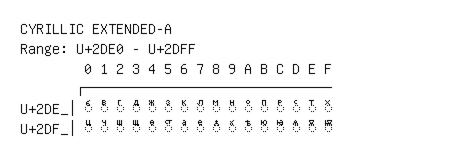

# Cyrillic Extended-A

**Range:** `U+2DE0` - `U+2DFF`

[← Back to Index](../README.md)

```text
        0 1 2 3 4 5 6 7 8 9 A B C D E F
       ┌───────────────────────────────
U+2DE_│◌ⷠ ◌ⷡ ◌ⷢ ◌ⷣ ◌ⷤ ◌ⷥ ◌ⷦ ◌ⷧ ◌ⷨ ◌ⷩ ◌ⷪ ◌ⷫ ◌ⷬ ◌ⷭ ◌ⷮ ◌ⷯ
U+2DF_│◌ⷰ ◌ⷱ ◌ⷲ ◌ⷳ ◌ⷴ ◌ⷵ ◌ⷶ ◌ⷷ ◌ⷸ ◌ⷹ ◌ⷺ ◌ⷻ ◌ⷼ ◌ⷽ ◌ⷾ ◌ⷿ
```

## Visual Fallback Reference
If your system lacks the required fonts to render these characters properly, use the image below as a visual guide.


