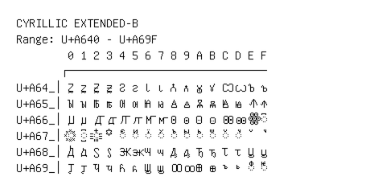

# Cyrillic Extended-B

**Range:** `U+A640` - `U+A69F`

[← Back to Index](../README.md)

```text
        0 1 2 3 4 5 6 7 8 9 A B C D E F
       ┌───────────────────────────────
U+A64_│Ꙁ ꙁ Ꙃ ꙃ Ꙅ ꙅ Ꙇ ꙇ Ꙉ ꙉ Ꙋ ꙋ Ꙍ ꙍ Ꙏ ꙏ
U+A65_│Ꙑ ꙑ Ꙓ ꙓ Ꙕ ꙕ Ꙗ ꙗ Ꙙ ꙙ Ꙛ ꙛ Ꙝ ꙝ Ꙟ ꙟ
U+A66_│Ꙡ ꙡ Ꙣ ꙣ Ꙥ ꙥ Ꙧ ꙧ Ꙩ ꙩ Ꙫ ꙫ Ꙭ ꙭ ꙮ ◌꙯
U+A67_│◌꙰ ◌꙱ ◌꙲ ꙳ ◌ꙴ ◌ꙵ ◌ꙶ ◌ꙷ ◌ꙸ ◌ꙹ ◌ꙺ ◌ꙻ ◌꙼ ◌꙽ ꙾ ꙿ
U+A68_│Ꚁ ꚁ Ꚃ ꚃ Ꚅ ꚅ Ꚇ ꚇ Ꚉ ꚉ Ꚋ ꚋ Ꚍ ꚍ Ꚏ ꚏ
U+A69_│Ꚑ ꚑ Ꚓ ꚓ Ꚕ ꚕ Ꚗ ꚗ Ꚙ ꚙ Ꚛ ꚛ ꚜ ꚝ ◌ꚞ ◌ꚟ
```

## Visual Fallback Reference
If your system lacks the required fonts to render these characters properly, use the image below as a visual guide.


