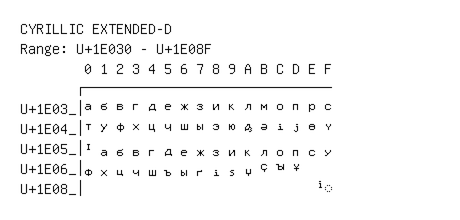

# Cyrillic Extended-D

**Range:** `U+1E030` - `U+1E08F`

[← Back to Index](../README.md)

```text
        0 1 2 3 4 5 6 7 8 9 A B C D E F
       ┌───────────────────────────────
U+1E03_│𞀰 𞀱 𞀲 𞀳 𞀴 𞀵 𞀶 𞀷 𞀸 𞀹 𞀺 𞀻 𞀼 𞀽 𞀾 𞀿
U+1E04_│𞁀 𞁁 𞁂 𞁃 𞁄 𞁅 𞁆 𞁇 𞁈 𞁉 𞁊 𞁋 𞁌 𞁍 𞁎 𞁏
U+1E05_│𞁐 𞁑 𞁒 𞁓 𞁔 𞁕 𞁖 𞁗 𞁘 𞁙 𞁚 𞁛 𞁜 𞁝 𞁞 𞁟
U+1E06_│𞁠 𞁡 𞁢 𞁣 𞁤 𞁥 𞁦 𞁧 𞁨 𞁩 𞁪 𞁫 𞁬 𞁭
U+1E08_│                              ◌𞂏
```

## Visual Fallback Reference
If your system lacks the required fonts to render these characters properly, use the image below as a visual guide.


