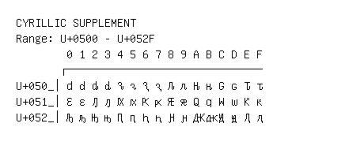

# Cyrillic Supplement

**Range:** `U+0500` - `U+052F`

[← Back to Index](../README.md)

```text
        0 1 2 3 4 5 6 7 8 9 A B C D E F
       ┌───────────────────────────────
U+050_│Ԁ ԁ Ԃ ԃ Ԅ ԅ Ԇ ԇ Ԉ ԉ Ԋ ԋ Ԍ ԍ Ԏ ԏ
U+051_│Ԑ ԑ Ԓ ԓ Ԕ ԕ Ԗ ԗ Ԙ ԙ Ԛ ԛ Ԝ ԝ Ԟ ԟ
U+052_│Ԡ ԡ Ԣ ԣ Ԥ ԥ Ԧ ԧ Ԩ ԩ Ԫ ԫ Ԭ ԭ Ԯ ԯ
```

## Visual Fallback Reference
If your system lacks the required fonts to render these characters properly, use the image below as a visual guide.


