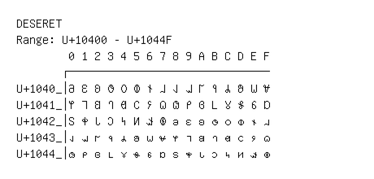

# Deseret

**Range:** `U+10400` - `U+1044F`

[← Back to Index](../README.md)

```text
        0 1 2 3 4 5 6 7 8 9 A B C D E F
       ┌───────────────────────────────
U+1040_│𐐀 𐐁 𐐂 𐐃 𐐄 𐐅 𐐆 𐐇 𐐈 𐐉 𐐊 𐐋 𐐌 𐐍 𐐎 𐐏
U+1041_│𐐐 𐐑 𐐒 𐐓 𐐔 𐐕 𐐖 𐐗 𐐘 𐐙 𐐚 𐐛 𐐜 𐐝 𐐞 𐐟
U+1042_│𐐠 𐐡 𐐢 𐐣 𐐤 𐐥 𐐦 𐐧 𐐨 𐐩 𐐪 𐐫 𐐬 𐐭 𐐮 𐐯
U+1043_│𐐰 𐐱 𐐲 𐐳 𐐴 𐐵 𐐶 𐐷 𐐸 𐐹 𐐺 𐐻 𐐼 𐐽 𐐾 𐐿
U+1044_│𐑀 𐑁 𐑂 𐑃 𐑄 𐑅 𐑆 𐑇 𐑈 𐑉 𐑊 𐑋 𐑌 𐑍 𐑎 𐑏
```

## Visual Fallback Reference
If your system lacks the required fonts to render these characters properly, use the image below as a visual guide.


