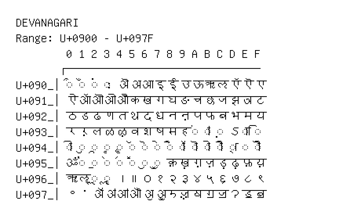

# Devanagari

**Range:** `U+0900` - `U+097F`

[← Back to Index](../README.md)

```text
        0 1 2 3 4 5 6 7 8 9 A B C D E F
       ┌───────────────────────────────
U+090_│◌ऀ ◌ँ ◌ं ◌ः ऄ अ आ इ ई उ ऊ ऋ ऌ ऍ ऎ ए
U+091_│ऐ ऑ ऒ ओ औ क ख ग घ ङ च छ ज झ ञ ट
U+092_│ठ ड ढ ण त थ द ध न ऩ प फ ब भ म य
U+093_│र ऱ ल ळ ऴ व श ष स ह ◌ऺ ◌ऻ ◌़ ऽ ◌ा ◌ि
U+094_│◌ी ◌ु ◌ू ◌ृ ◌ॄ ◌ॅ ◌ॆ ◌े ◌ै ◌ॉ ◌ॊ ◌ो ◌ौ ◌् ◌ॎ ◌ॏ
U+095_│ॐ ◌॑ ◌॒ ◌॓ ◌॔ ◌ॕ ◌ॖ ◌ॗ क़ ख़ ग़ ज़ ड़ ढ़ फ़ य़
U+096_│ॠ ॡ ◌ॢ ◌ॣ । ॥ ० १ २ ३ ४ ५ ६ ७ ८ ९
U+097_│॰ ॱ ॲ ॳ ॴ ॵ ॶ ॷ ॸ ॹ ॺ ॻ ॼ ॽ ॾ ॿ
```

## Visual Fallback Reference
If your system lacks the required fonts to render these characters properly, use the image below as a visual guide.


