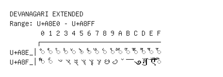

# Devanagari Extended

**Range:** `U+A8E0` - `U+A8FF`

[← Back to Index](../README.md)

```text
        0 1 2 3 4 5 6 7 8 9 A B C D E F
       ┌───────────────────────────────
U+A8E_│◌꣠ ◌꣡ ◌꣢ ◌꣣ ◌꣤ ◌꣥ ◌꣦ ◌꣧ ◌꣨ ◌꣩ ◌꣪ ◌꣫ ◌꣬ ◌꣭ ◌꣮ ◌꣯
U+A8F_│◌꣰ ◌꣱ ꣲ ꣳ ꣴ ꣵ ꣶ ꣷ ꣸ ꣹ ꣺ ꣻ ꣼ ꣽ ꣾ ◌ꣿ
```

## Visual Fallback Reference
If your system lacks the required fonts to render these characters properly, use the image below as a visual guide.


