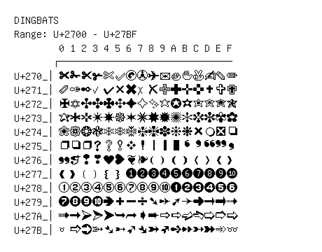

# Dingbats

**Range:** `U+2700` - `U+27BF`

[← Back to Index](../README.md)

```text
        0 1 2 3 4 5 6 7 8 9 A B C D E F
       ┌───────────────────────────────
U+270_│✀ ✁ ✂ ✃ ✄ ✅✆ ✇ ✈ ✉ ✊✋✌ ✍ ✎ ✏
U+271_│✐ ✑ ✒ ✓ ✔ ✕ ✖ ✗ ✘ ✙ ✚ ✛ ✜ ✝ ✞ ✟
U+272_│✠ ✡ ✢ ✣ ✤ ✥ ✦ ✧ ✨✩ ✪ ✫ ✬ ✭ ✮ ✯
U+273_│✰ ✱ ✲ ✳ ✴ ✵ ✶ ✷ ✸ ✹ ✺ ✻ ✼ ✽ ✾ ✿
U+274_│❀ ❁ ❂ ❃ ❄ ❅ ❆ ❇ ❈ ❉ ❊ ❋ ❌❍ ❎❏
U+275_│❐ ❑ ❒ ❓❔❕❖ ❗❘ ❙ ❚ ❛ ❜ ❝ ❞ ❟
U+276_│❠ ❡ ❢ ❣ ❤ ❥ ❦ ❧ ❨ ❩ ❪ ❫ ❬ ❭ ❮ ❯
U+277_│❰ ❱ ❲ ❳ ❴ ❵ ❶ ❷ ❸ ❹ ❺ ❻ ❼ ❽ ❾ ❿
U+278_│➀ ➁ ➂ ➃ ➄ ➅ ➆ ➇ ➈ ➉ ➊ ➋ ➌ ➍ ➎ ➏
U+279_│➐ ➑ ➒ ➓ ➔ ➕➖➗➘ ➙ ➚ ➛ ➜ ➝ ➞ ➟
U+27A_│➠ ➡ ➢ ➣ ➤ ➥ ➦ ➧ ➨ ➩ ➪ ➫ ➬ ➭ ➮ ➯
U+27B_│➰➱ ➲ ➳ ➴ ➵ ➶ ➷ ➸ ➹ ➺ ➻ ➼ ➽ ➾ ➿
```

## Visual Fallback Reference
If your system lacks the required fonts to render these characters properly, use the image below as a visual guide.


