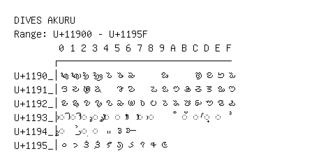

# Dives Akuru

**Range:** `U+11900` - `U+1195F`

[← Back to Index](../README.md)

```text
        0 1 2 3 4 5 6 7 8 9 A B C D E F
       ┌───────────────────────────────
U+1190_│𑤀 𑤁 𑤂 𑤃 𑤄 𑤅 𑤆     𑤉     𑤌 𑤍 𑤎 𑤏
U+1191_│𑤐 𑤑 𑤒 𑤓   𑤕 𑤖   𑤘 𑤙 𑤚 𑤛 𑤜 𑤝 𑤞 𑤟
U+1192_│𑤠 𑤡 𑤢 𑤣 𑤤 𑤥 𑤦 𑤧 𑤨 𑤩 𑤪 𑤫 𑤬 𑤭 𑤮 𑤯
U+1193_│◌𑤰 ◌𑤱 ◌𑤲 ◌𑤳 ◌𑤴 ◌𑤵   ◌𑤷 ◌𑤸     ◌𑤻 ◌𑤼 ◌𑤽 ◌𑤾 𑤿
U+1194_│◌𑥀 𑥁 ◌𑥂 ◌𑥃 𑥄 𑥅 𑥆
U+1195_│𑥐 𑥑 𑥒 𑥓 𑥔 𑥕 𑥖 𑥗 𑥘 𑥙
```

## Visual Fallback Reference
If your system lacks the required fonts to render these characters properly, use the image below as a visual guide.


