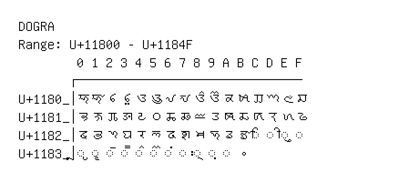

# Dogra

**Range:** `U+11800` - `U+1184F`

[← Back to Index](../README.md)

```text
        0 1 2 3 4 5 6 7 8 9 A B C D E F
       ┌───────────────────────────────
U+1180_│𑠀 𑠁 𑠂 𑠃 𑠄 𑠅 𑠆 𑠇 𑠈 𑠉 𑠊 𑠋 𑠌 𑠍 𑠎 𑠏
U+1181_│𑠐 𑠑 𑠒 𑠓 𑠔 𑠕 𑠖 𑠗 𑠘 𑠙 𑠚 𑠛 𑠜 𑠝 𑠞 𑠟
U+1182_│𑠠 𑠡 𑠢 𑠣 𑠤 𑠥 𑠦 𑠧 𑠨 𑠩 𑠪 𑠫 ◌𑠬 ◌𑠭 ◌𑠮 ◌𑠯
U+1183_│◌𑠰 ◌𑠱 ◌𑠲 ◌𑠳 ◌𑠴 ◌𑠵 ◌𑠶 ◌𑠷 ◌𑠸 ◌𑠹 ◌𑠺 𑠻
```

## Visual Fallback Reference
If your system lacks the required fonts to render these characters properly, use the image below as a visual guide.


