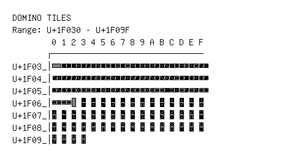

# Domino Tiles

**Range:** `U+1F030` - `U+1F09F`

[← Back to Index](../README.md)

```text
        0 1 2 3 4 5 6 7 8 9 A B C D E F
       ┌───────────────────────────────
U+1F03_│🀰 🀱 🀲 🀳 🀴 🀵 🀶 🀷 🀸 🀹 🀺 🀻 🀼 🀽 🀾 🀿
U+1F04_│🁀 🁁 🁂 🁃 🁄 🁅 🁆 🁇 🁈 🁉 🁊 🁋 🁌 🁍 🁎 🁏
U+1F05_│🁐 🁑 🁒 🁓 🁔 🁕 🁖 🁗 🁘 🁙 🁚 🁛 🁜 🁝 🁞 🁟
U+1F06_│🁠 🁡 🁢 🁣 🁤 🁥 🁦 🁧 🁨 🁩 🁪 🁫 🁬 🁭 🁮 🁯
U+1F07_│🁰 🁱 🁲 🁳 🁴 🁵 🁶 🁷 🁸 🁹 🁺 🁻 🁼 🁽 🁾 🁿
U+1F08_│🂀 🂁 🂂 🂃 🂄 🂅 🂆 🂇 🂈 🂉 🂊 🂋 🂌 🂍 🂎 🂏
U+1F09_│🂐 🂑 🂒 🂓
```

## Visual Fallback Reference
If your system lacks the required fonts to render these characters properly, use the image below as a visual guide.


