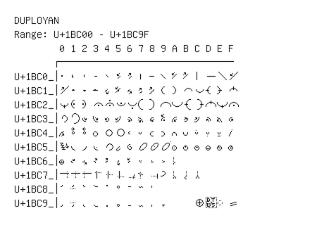

# Duployan

**Range:** `U+1BC00` - `U+1BC9F`

[← Back to Index](../README.md)

```text
        0 1 2 3 4 5 6 7 8 9 A B C D E F
       ┌───────────────────────────────
U+1BC0_│𛰀 𛰁 𛰂 𛰃 𛰄 𛰅 𛰆 𛰇 𛰈 𛰉 𛰊 𛰋 𛰌 𛰍 𛰎 𛰏
U+1BC1_│𛰐 𛰑 𛰒 𛰓 𛰔 𛰕 𛰖 𛰗 𛰘 𛰙 𛰚 𛰛 𛰜 𛰝 𛰞 𛰟
U+1BC2_│𛰠 𛰡 𛰢 𛰣 𛰤 𛰥 𛰦 𛰧 𛰨 𛰩 𛰪 𛰫 𛰬 𛰭 𛰮 𛰯
U+1BC3_│𛰰 𛰱 𛰲 𛰳 𛰴 𛰵 𛰶 𛰷 𛰸 𛰹 𛰺 𛰻 𛰼 𛰽 𛰾 𛰿
U+1BC4_│𛱀 𛱁 𛱂 𛱃 𛱄 𛱅 𛱆 𛱇 𛱈 𛱉 𛱊 𛱋 𛱌 𛱍 𛱎 𛱏
U+1BC5_│𛱐 𛱑 𛱒 𛱓 𛱔 𛱕 𛱖 𛱗 𛱘 𛱙 𛱚 𛱛 𛱜 𛱝 𛱞 𛱟
U+1BC6_│𛱠 𛱡 𛱢 𛱣 𛱤 𛱥 𛱦 𛱧 𛱨 𛱩 𛱪
U+1BC7_│𛱰 𛱱 𛱲 𛱳 𛱴 𛱵 𛱶 𛱷 𛱸 𛱹 𛱺 𛱻 𛱼
U+1BC8_│𛲀 𛲁 𛲂 𛲃 𛲄 𛲅 𛲆 𛲇 𛲈
U+1BC9_│𛲐 𛲑 𛲒 𛲓 𛲔 𛲕 𛲖 𛲗 𛲘 𛲙     𛲜 ◌𛲝 ◌𛲞 𛲟
```

## Visual Fallback Reference
If your system lacks the required fonts to render these characters properly, use the image below as a visual guide.


