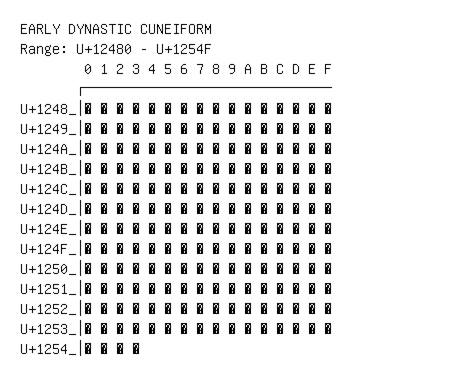

# Early Dynastic Cuneiform

**Range:** `U+12480` - `U+1254F`

[← Back to Index](../README.md)

```text
        0 1 2 3 4 5 6 7 8 9 A B C D E F
       ┌───────────────────────────────
U+1248_│𒒀 𒒁 𒒂 𒒃 𒒄 𒒅 𒒆 𒒇 𒒈 𒒉 𒒊 𒒋 𒒌 𒒍 𒒎 𒒏
U+1249_│𒒐 𒒑 𒒒 𒒓 𒒔 𒒕 𒒖 𒒗 𒒘 𒒙 𒒚 𒒛 𒒜 𒒝 𒒞 𒒟
U+124A_│𒒠 𒒡 𒒢 𒒣 𒒤 𒒥 𒒦 𒒧 𒒨 𒒩 𒒪 𒒫 𒒬 𒒭 𒒮 𒒯
U+124B_│𒒰 𒒱 𒒲 𒒳 𒒴 𒒵 𒒶 𒒷 𒒸 𒒹 𒒺 𒒻 𒒼 𒒽 𒒾 𒒿
U+124C_│𒓀 𒓁 𒓂 𒓃 𒓄 𒓅 𒓆 𒓇 𒓈 𒓉 𒓊 𒓋 𒓌 𒓍 𒓎 𒓏
U+124D_│𒓐 𒓑 𒓒 𒓓 𒓔 𒓕 𒓖 𒓗 𒓘 𒓙 𒓚 𒓛 𒓜 𒓝 𒓞 𒓟
U+124E_│𒓠 𒓡 𒓢 𒓣 𒓤 𒓥 𒓦 𒓧 𒓨 𒓩 𒓪 𒓫 𒓬 𒓭 𒓮 𒓯
U+124F_│𒓰 𒓱 𒓲 𒓳 𒓴 𒓵 𒓶 𒓷 𒓸 𒓹 𒓺 𒓻 𒓼 𒓽 𒓾 𒓿
U+1250_│𒔀 𒔁 𒔂 𒔃 𒔄 𒔅 𒔆 𒔇 𒔈 𒔉 𒔊 𒔋 𒔌 𒔍 𒔎 𒔏
U+1251_│𒔐 𒔑 𒔒 𒔓 𒔔 𒔕 𒔖 𒔗 𒔘 𒔙 𒔚 𒔛 𒔜 𒔝 𒔞 𒔟
U+1252_│𒔠 𒔡 𒔢 𒔣 𒔤 𒔥 𒔦 𒔧 𒔨 𒔩 𒔪 𒔫 𒔬 𒔭 𒔮 𒔯
U+1253_│𒔰 𒔱 𒔲 𒔳 𒔴 𒔵 𒔶 𒔷 𒔸 𒔹 𒔺 𒔻 𒔼 𒔽 𒔾 𒔿
U+1254_│𒕀 𒕁 𒕂 𒕃
```

## Visual Fallback Reference
If your system lacks the required fonts to render these characters properly, use the image below as a visual guide.


