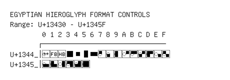

# Egyptian Hieroglyph Format Controls

**Range:** `U+13430` - `U+1345F`

[← Back to Index](../README.md)

```text
        0 1 2 3 4 5 6 7 8 9 A B C D E F
       ┌───────────────────────────────
U+1344_│◌𓑀 𓑁 𓑂 𓑃 𓑄 𓑅 𓑆 ◌𓑇 ◌𓑈 ◌𓑉 ◌𓑊 ◌𓑋 ◌𓑌 ◌𓑍 ◌𓑎 ◌𓑏
U+1345_│◌𓑐 ◌𓑑 ◌𓑒 ◌𓑓 ◌𓑔 ◌𓑕
```

## Visual Fallback Reference
If your system lacks the required fonts to render these characters properly, use the image below as a visual guide.


