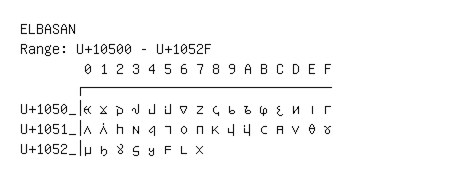

# Elbasan

**Range:** `U+10500` - `U+1052F`

[← Back to Index](../README.md)

```text
        0 1 2 3 4 5 6 7 8 9 A B C D E F
       ┌───────────────────────────────
U+1050_│𐔀 𐔁 𐔂 𐔃 𐔄 𐔅 𐔆 𐔇 𐔈 𐔉 𐔊 𐔋 𐔌 𐔍 𐔎 𐔏
U+1051_│𐔐 𐔑 𐔒 𐔓 𐔔 𐔕 𐔖 𐔗 𐔘 𐔙 𐔚 𐔛 𐔜 𐔝 𐔞 𐔟
U+1052_│𐔠 𐔡 𐔢 𐔣 𐔤 𐔥 𐔦 𐔧
```

## Visual Fallback Reference
If your system lacks the required fonts to render these characters properly, use the image below as a visual guide.


