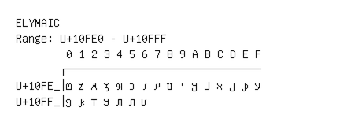

# Elymaic

**Range:** `U+10FE0` - `U+10FFF`

[← Back to Index](../README.md)

```text
        0 1 2 3 4 5 6 7 8 9 A B C D E F
       ┌───────────────────────────────
U+10FE_│𐿠 𐿡 𐿢 𐿣 𐿤 𐿥 𐿦 𐿧 𐿨 𐿩 𐿪 𐿫 𐿬 𐿭 𐿮 𐿯
U+10FF_│𐿰 𐿱 𐿲 𐿳 𐿴 𐿵 𐿶
```

## Visual Fallback Reference
If your system lacks the required fonts to render these characters properly, use the image below as a visual guide.


