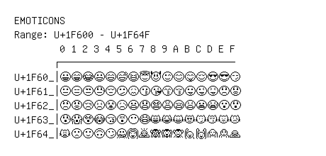

# Emoticons

**Range:** `U+1F600` - `U+1F64F`

[← Back to Index](../README.md)

```text
        0 1 2 3 4 5 6 7 8 9 A B C D E F
       ┌───────────────────────────────
U+1F60_│😀😁😂😃😄😅😆😇😈😉😊😋😌😍😎😏
U+1F61_│😐😑😒😓😔😕😖😗😘😙😚😛😜😝😞😟
U+1F62_│😠😡😢😣😤😥😦😧😨😩😪😫😬😭😮😯
U+1F63_│😰😱😲😳😴😵😶😷😸😹😺😻😼😽😾😿
U+1F64_│🙀🙁🙂🙃🙄🙅🙆🙇🙈🙉🙊🙋🙌🙍🙎🙏
```

## Visual Fallback Reference
If your system lacks the required fonts to render these characters properly, use the image below as a visual guide.


