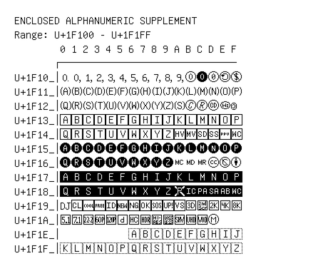

# Enclosed Alphanumeric Supplement

**Range:** `U+1F100` - `U+1F1FF`

[← Back to Index](../README.md)

```text
        0 1 2 3 4 5 6 7 8 9 A B C D E F
       ┌───────────────────────────────
U+1F10_│🄀 🄁 🄂 🄃 🄄 🄅 🄆 🄇 🄈 🄉 🄊 🄋 🄌 🄍 🄎 🄏
U+1F11_│🄐 🄑 🄒 🄓 🄔 🄕 🄖 🄗 🄘 🄙 🄚 🄛 🄜 🄝 🄞 🄟
U+1F12_│🄠 🄡 🄢 🄣 🄤 🄥 🄦 🄧 🄨 🄩 🄪 🄫 🄬 🄭 🄮 🄯
U+1F13_│🄰 🄱 🄲 🄳 🄴 🄵 🄶 🄷 🄸 🄹 🄺 🄻 🄼 🄽 🄾 🄿
U+1F14_│🅀 🅁 🅂 🅃 🅄 🅅 🅆 🅇 🅈 🅉 🅊 🅋 🅌 🅍 🅎 🅏
U+1F15_│🅐 🅑 🅒 🅓 🅔 🅕 🅖 🅗 🅘 🅙 🅚 🅛 🅜 🅝 🅞 🅟
U+1F16_│🅠 🅡 🅢 🅣 🅤 🅥 🅦 🅧 🅨 🅩 🅪 🅫 🅬 🅭 🅮 🅯
U+1F17_│🅰 🅱 🅲 🅳 🅴 🅵 🅶 🅷 🅸 🅹 🅺 🅻 🅼 🅽 🅾 🅿
U+1F18_│🆀 🆁 🆂 🆃 🆄 🆅 🆆 🆇 🆈 🆉 🆊 🆋 🆌 🆍 🆎🆏
U+1F19_│🆐 🆑🆒🆓🆔🆕🆖🆗🆘🆙🆚🆛 🆜 🆝 🆞 🆟
U+1F1A_│🆠 🆡 🆢 🆣 🆤 🆥 🆦 🆧 🆨 🆩 🆪 🆫 🆬 🆭
U+1F1E_│            🇦 🇧 🇨 🇩 🇪 🇫 🇬 🇭 🇮 🇯
U+1F1F_│🇰 🇱 🇲 🇳 🇴 🇵 🇶 🇷 🇸 🇹 🇺 🇻 🇼 🇽 🇾 🇿
```

## Visual Fallback Reference
If your system lacks the required fonts to render these characters properly, use the image below as a visual guide.


