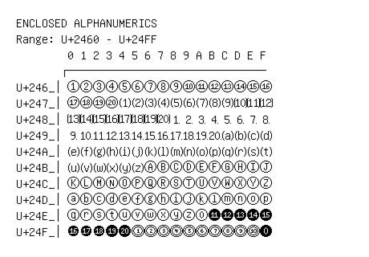

# Enclosed Alphanumerics

**Range:** `U+2460` - `U+24FF`

[← Back to Index](../README.md)

```text
        0 1 2 3 4 5 6 7 8 9 A B C D E F
       ┌───────────────────────────────
U+246_│① ② ③ ④ ⑤ ⑥ ⑦ ⑧ ⑨ ⑩ ⑪ ⑫ ⑬ ⑭ ⑮ ⑯
U+247_│⑰ ⑱ ⑲ ⑳ ⑴ ⑵ ⑶ ⑷ ⑸ ⑹ ⑺ ⑻ ⑼ ⑽ ⑾ ⑿
U+248_│⒀ ⒁ ⒂ ⒃ ⒄ ⒅ ⒆ ⒇ ⒈ ⒉ ⒊ ⒋ ⒌ ⒍ ⒎ ⒏
U+249_│⒐ ⒑ ⒒ ⒓ ⒔ ⒕ ⒖ ⒗ ⒘ ⒙ ⒚ ⒛ ⒜ ⒝ ⒞ ⒟
U+24A_│⒠ ⒡ ⒢ ⒣ ⒤ ⒥ ⒦ ⒧ ⒨ ⒩ ⒪ ⒫ ⒬ ⒭ ⒮ ⒯
U+24B_│⒰ ⒱ ⒲ ⒳ ⒴ ⒵ Ⓐ Ⓑ Ⓒ Ⓓ Ⓔ Ⓕ Ⓖ Ⓗ Ⓘ Ⓙ
U+24C_│Ⓚ Ⓛ Ⓜ Ⓝ Ⓞ Ⓟ Ⓠ Ⓡ Ⓢ Ⓣ Ⓤ Ⓥ Ⓦ Ⓧ Ⓨ Ⓩ
U+24D_│ⓐ ⓑ ⓒ ⓓ ⓔ ⓕ ⓖ ⓗ ⓘ ⓙ ⓚ ⓛ ⓜ ⓝ ⓞ ⓟ
U+24E_│ⓠ ⓡ ⓢ ⓣ ⓤ ⓥ ⓦ ⓧ ⓨ ⓩ ⓪ ⓫ ⓬ ⓭ ⓮ ⓯
U+24F_│⓰ ⓱ ⓲ ⓳ ⓴ ⓵ ⓶ ⓷ ⓸ ⓹ ⓺ ⓻ ⓼ ⓽ ⓾ ⓿
```

## Visual Fallback Reference
If your system lacks the required fonts to render these characters properly, use the image below as a visual guide.


