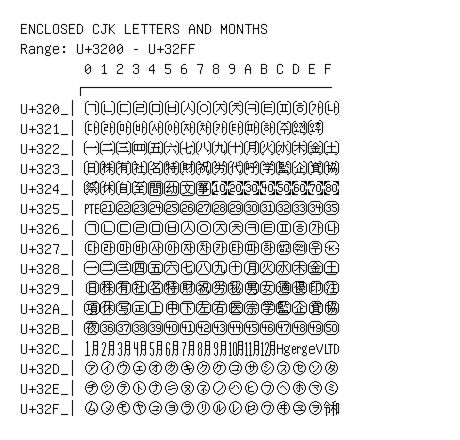

# Enclosed CJK Letters and Months

**Range:** `U+3200` - `U+32FF`

[← Back to Index](../README.md)

```text
        0 1 2 3 4 5 6 7 8 9 A B C D E F
       ┌───────────────────────────────
U+320_│㈀㈁㈂㈃㈄㈅㈆㈇㈈㈉㈊㈋㈌㈍㈎㈏
U+321_│㈐㈑㈒㈓㈔㈕㈖㈗㈘㈙㈚㈛㈜㈝㈞
U+322_│㈠㈡㈢㈣㈤㈥㈦㈧㈨㈩㈪㈫㈬㈭㈮㈯
U+323_│㈰㈱㈲㈳㈴㈵㈶㈷㈸㈹㈺㈻㈼㈽㈾㈿
U+324_│㉀㉁㉂㉃㉄㉅㉆㉇㉈ ㉉ ㉊ ㉋ ㉌ ㉍ ㉎ ㉏
U+325_│㉐㉑㉒㉓㉔㉕㉖㉗㉘㉙㉚㉛㉜㉝㉞㉟
U+326_│㉠㉡㉢㉣㉤㉥㉦㉧㉨㉩㉪㉫㉬㉭㉮㉯
U+327_│㉰㉱㉲㉳㉴㉵㉶㉷㉸㉹㉺㉻㉼㉽㉾㉿
U+328_│㊀㊁㊂㊃㊄㊅㊆㊇㊈㊉㊊㊋㊌㊍㊎㊏
U+329_│㊐㊑㊒㊓㊔㊕㊖㊗㊘㊙㊚㊛㊜㊝㊞㊟
U+32A_│㊠㊡㊢㊣㊤㊥㊦㊧㊨㊩㊪㊫㊬㊭㊮㊯
U+32B_│㊰㊱㊲㊳㊴㊵㊶㊷㊸㊹㊺㊻㊼㊽㊾㊿
U+32C_│㋀㋁㋂㋃㋄㋅㋆㋇㋈㋉㋊㋋㋌㋍㋎㋏
U+32D_│㋐㋑㋒㋓㋔㋕㋖㋗㋘㋙㋚㋛㋜㋝㋞㋟
U+32E_│㋠㋡㋢㋣㋤㋥㋦㋧㋨㋩㋪㋫㋬㋭㋮㋯
U+32F_│㋰㋱㋲㋳㋴㋵㋶㋷㋸㋹㋺㋻㋼㋽㋾㋿
```

## Visual Fallback Reference
If your system lacks the required fonts to render these characters properly, use the image below as a visual guide.


