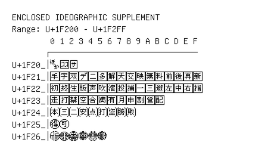

# Enclosed Ideographic Supplement

**Range:** `U+1F200` - `U+1F2FF`

[← Back to Index](../README.md)

```text
        0 1 2 3 4 5 6 7 8 9 A B C D E F
       ┌───────────────────────────────
U+1F20_│🈀🈁🈂
U+1F21_│🈐🈑🈒🈓🈔🈕🈖🈗🈘🈙🈚🈛🈜🈝🈞🈟
U+1F22_│🈠🈡🈢🈣🈤🈥🈦🈧🈨🈩🈪🈫🈬🈭🈮🈯
U+1F23_│🈰🈱🈲🈳🈴🈵🈶🈷🈸🈹🈺🈻
U+1F24_│🉀🉁🉂🉃🉄🉅🉆🉇🉈
U+1F25_│🉐🉑
U+1F26_│🉠🉡🉢🉣🉤🉥
```

## Visual Fallback Reference
If your system lacks the required fonts to render these characters properly, use the image below as a visual guide.


