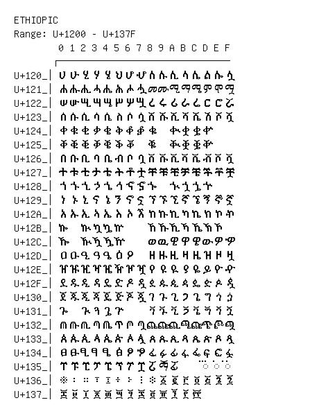

# Ethiopic

**Range:** `U+1200` - `U+137F`

[← Back to Index](../README.md)

```text
        0 1 2 3 4 5 6 7 8 9 A B C D E F
       ┌───────────────────────────────
U+120_│ሀ ሁ ሂ ሃ ሄ ህ ሆ ሇ ለ ሉ ሊ ላ ሌ ል ሎ ሏ
U+121_│ሐ ሑ ሒ ሓ ሔ ሕ ሖ ሗ መ ሙ ሚ ማ ሜ ም ሞ ሟ
U+122_│ሠ ሡ ሢ ሣ ሤ ሥ ሦ ሧ ረ ሩ ሪ ራ ሬ ር ሮ ሯ
U+123_│ሰ ሱ ሲ ሳ ሴ ስ ሶ ሷ ሸ ሹ ሺ ሻ ሼ ሽ ሾ ሿ
U+124_│ቀ ቁ ቂ ቃ ቄ ቅ ቆ ቇ ቈ   ቊ ቋ ቌ ቍ
U+125_│ቐ ቑ ቒ ቓ ቔ ቕ ቖ   ቘ   ቚ ቛ ቜ ቝ
U+126_│በ ቡ ቢ ባ ቤ ብ ቦ ቧ ቨ ቩ ቪ ቫ ቬ ቭ ቮ ቯ
U+127_│ተ ቱ ቲ ታ ቴ ት ቶ ቷ ቸ ቹ ቺ ቻ ቼ ች ቾ ቿ
U+128_│ኀ ኁ ኂ ኃ ኄ ኅ ኆ ኇ ኈ   ኊ ኋ ኌ ኍ
U+129_│ነ ኑ ኒ ና ኔ ን ኖ ኗ ኘ ኙ ኚ ኛ ኜ ኝ ኞ ኟ
U+12A_│አ ኡ ኢ ኣ ኤ እ ኦ ኧ ከ ኩ ኪ ካ ኬ ክ ኮ ኯ
U+12B_│ኰ   ኲ ኳ ኴ ኵ     ኸ ኹ ኺ ኻ ኼ ኽ ኾ
U+12C_│ዀ   ዂ ዃ ዄ ዅ     ወ ዉ ዊ ዋ ዌ ው ዎ ዏ
U+12D_│ዐ ዑ ዒ ዓ ዔ ዕ ዖ   ዘ ዙ ዚ ዛ ዜ ዝ ዞ ዟ
U+12E_│ዠ ዡ ዢ ዣ ዤ ዥ ዦ ዧ የ ዩ ዪ ያ ዬ ይ ዮ ዯ
U+12F_│ደ ዱ ዲ ዳ ዴ ድ ዶ ዷ ዸ ዹ ዺ ዻ ዼ ዽ ዾ ዿ
U+130_│ጀ ጁ ጂ ጃ ጄ ጅ ጆ ጇ ገ ጉ ጊ ጋ ጌ ግ ጎ ጏ
U+131_│ጐ   ጒ ጓ ጔ ጕ     ጘ ጙ ጚ ጛ ጜ ጝ ጞ ጟ
U+132_│ጠ ጡ ጢ ጣ ጤ ጥ ጦ ጧ ጨ ጩ ጪ ጫ ጬ ጭ ጮ ጯ
U+133_│ጰ ጱ ጲ ጳ ጴ ጵ ጶ ጷ ጸ ጹ ጺ ጻ ጼ ጽ ጾ ጿ
U+134_│ፀ ፁ ፂ ፃ ፄ ፅ ፆ ፇ ፈ ፉ ፊ ፋ ፌ ፍ ፎ ፏ
U+135_│ፐ ፑ ፒ ፓ ፔ ፕ ፖ ፗ ፘ ፙ ፚ     ◌፝ ◌፞ ◌፟
U+136_│፠ ፡ ። ፣ ፤ ፥ ፦ ፧ ፨ ፩ ፪ ፫ ፬ ፭ ፮ ፯
U+137_│፰ ፱ ፲ ፳ ፴ ፵ ፶ ፷ ፸ ፹ ፺ ፻ ፼
```

## Visual Fallback Reference
If your system lacks the required fonts to render these characters properly, use the image below as a visual guide.


