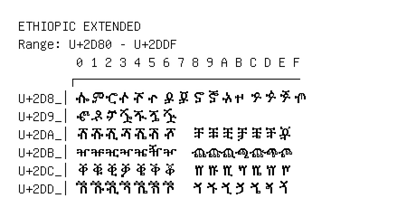

# Ethiopic Extended

**Range:** `U+2D80` - `U+2DDF`

[← Back to Index](../README.md)

```text
        0 1 2 3 4 5 6 7 8 9 A B C D E F
       ┌───────────────────────────────
U+2D8_│ⶀ ⶁ ⶂ ⶃ ⶄ ⶅ ⶆ ⶇ ⶈ ⶉ ⶊ ⶋ ⶌ ⶍ ⶎ ⶏ
U+2D9_│ⶐ ⶑ ⶒ ⶓ ⶔ ⶕ ⶖ
U+2DA_│ⶠ ⶡ ⶢ ⶣ ⶤ ⶥ ⶦ   ⶨ ⶩ ⶪ ⶫ ⶬ ⶭ ⶮ
U+2DB_│ⶰ ⶱ ⶲ ⶳ ⶴ ⶵ ⶶ   ⶸ ⶹ ⶺ ⶻ ⶼ ⶽ ⶾ
U+2DC_│ⷀ ⷁ ⷂ ⷃ ⷄ ⷅ ⷆ   ⷈ ⷉ ⷊ ⷋ ⷌ ⷍ ⷎ
U+2DD_│ⷐ ⷑ ⷒ ⷓ ⷔ ⷕ ⷖ   ⷘ ⷙ ⷚ ⷛ ⷜ ⷝ ⷞ
```

## Visual Fallback Reference
If your system lacks the required fonts to render these characters properly, use the image below as a visual guide.


