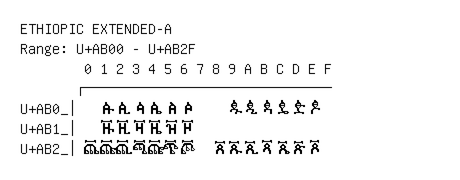

# Ethiopic Extended-A

**Range:** `U+AB00` - `U+AB2F`

[← Back to Index](../README.md)

```text
        0 1 2 3 4 5 6 7 8 9 A B C D E F
       ┌───────────────────────────────
U+AB0_│  ꬁ ꬂ ꬃ ꬄ ꬅ ꬆ     ꬉ ꬊ ꬋ ꬌ ꬍ ꬎ
U+AB1_│  ꬑ ꬒ ꬓ ꬔ ꬕ ꬖ
U+AB2_│ꬠ ꬡ ꬢ ꬣ ꬤ ꬥ ꬦ   ꬨ ꬩ ꬪ ꬫ ꬬ ꬭ ꬮ
```

## Visual Fallback Reference
If your system lacks the required fonts to render these characters properly, use the image below as a visual guide.


