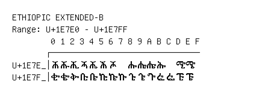

# Ethiopic Extended-B

**Range:** `U+1E7E0` - `U+1E7FF`

[← Back to Index](../README.md)

```text
        0 1 2 3 4 5 6 7 8 9 A B C D E F
       ┌───────────────────────────────
U+1E7E_│𞟠 𞟡 𞟢 𞟣 𞟤 𞟥 𞟦   𞟨 𞟩 𞟪 𞟫   𞟭 𞟮
U+1E7F_│𞟰 𞟱 𞟲 𞟳 𞟴 𞟵 𞟶 𞟷 𞟸 𞟹 𞟺 𞟻 𞟼 𞟽 𞟾
```

## Visual Fallback Reference
If your system lacks the required fonts to render these characters properly, use the image below as a visual guide.


