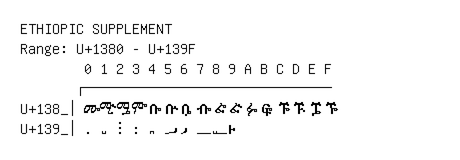

# Ethiopic Supplement

**Range:** `U+1380` - `U+139F`

[← Back to Index](../README.md)

```text
        0 1 2 3 4 5 6 7 8 9 A B C D E F
       ┌───────────────────────────────
U+138_│ᎀ ᎁ ᎂ ᎃ ᎄ ᎅ ᎆ ᎇ ᎈ ᎉ ᎊ ᎋ ᎌ ᎍ ᎎ ᎏ
U+139_│᎐ ᎑ ᎒ ᎓ ᎔ ᎕ ᎖ ᎗ ᎘ ᎙
```

## Visual Fallback Reference
If your system lacks the required fonts to render these characters properly, use the image below as a visual guide.


