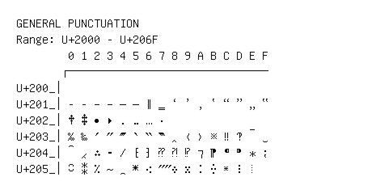

# General Punctuation

**Range:** `U+2000` - `U+206F`

[← Back to Index](../README.md)

```text
        0 1 2 3 4 5 6 7 8 9 A B C D E F
       ┌───────────────────────────────
U+200_│
U+201_│‐ ‑ ‒ – — ― ‖ ‗ ‘ ’ ‚ ‛ “ ” „ ‟
U+202_│† ‡ • ‣ ․ ‥ … ‧
U+203_│‰ ‱ ′ ″ ‴ ‵ ‶ ‷ ‸ ‹ › ※ ‼ ‽ ‾ ‿
U+204_│⁀ ⁁ ⁂ ⁃ ⁄ ⁅ ⁆ ⁇ ⁈ ⁉ ⁊ ⁋ ⁌ ⁍ ⁎ ⁏
U+205_│⁐ ⁑ ⁒ ⁓ ⁔ ⁕ ⁖ ⁗ ⁘ ⁙ ⁚ ⁛ ⁜ ⁝ ⁞
```

## Visual Fallback Reference
If your system lacks the required fonts to render these characters properly, use the image below as a visual guide.


