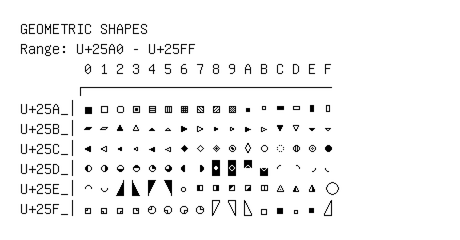

# Geometric Shapes

**Range:** `U+25A0` - `U+25FF`

[← Back to Index](../README.md)

```text
        0 1 2 3 4 5 6 7 8 9 A B C D E F
       ┌───────────────────────────────
U+25A_│■ □ ▢ ▣ ▤ ▥ ▦ ▧ ▨ ▩ ▪ ▫ ▬ ▭ ▮ ▯
U+25B_│▰ ▱ ▲ △ ▴ ▵ ▶ ▷ ▸ ▹ ► ▻ ▼ ▽ ▾ ▿
U+25C_│◀ ◁ ◂ ◃ ◄ ◅ ◆ ◇ ◈ ◉ ◊ ○ ◌ ◍ ◎ ●
U+25D_│◐ ◑ ◒ ◓ ◔ ◕ ◖ ◗ ◘ ◙ ◚ ◛ ◜ ◝ ◞ ◟
U+25E_│◠ ◡ ◢ ◣ ◤ ◥ ◦ ◧ ◨ ◩ ◪ ◫ ◬ ◭ ◮ ◯
U+25F_│◰ ◱ ◲ ◳ ◴ ◵ ◶ ◷ ◸ ◹ ◺ ◻ ◼ ◽◾◿
```

## Visual Fallback Reference
If your system lacks the required fonts to render these characters properly, use the image below as a visual guide.


