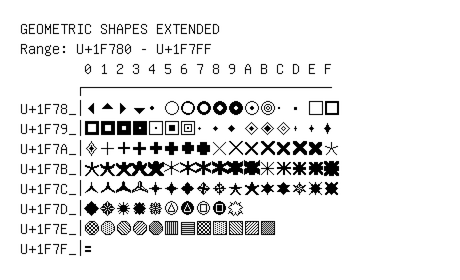

# Geometric Shapes Extended

**Range:** `U+1F780` - `U+1F7FF`

[← Back to Index](../README.md)

```text
        0 1 2 3 4 5 6 7 8 9 A B C D E F
       ┌───────────────────────────────
U+1F78_│🞀 🞁 🞂 🞃 🞄 🞅 🞆 🞇 🞈 🞉 🞊 🞋 🞌 🞍 🞎 🞏
U+1F79_│🞐 🞑 🞒 🞓 🞔 🞕 🞖 🞗 🞘 🞙 🞚 🞛 🞜 🞝 🞞 🞟
U+1F7A_│🞠 🞡 🞢 🞣 🞤 🞥 🞦 🞧 🞨 🞩 🞪 🞫 🞬 🞭 🞮 🞯
U+1F7B_│🞰 🞱 🞲 🞳 🞴 🞵 🞶 🞷 🞸 🞹 🞺 🞻 🞼 🞽 🞾 🞿
U+1F7C_│🟀 🟁 🟂 🟃 🟄 🟅 🟆 🟇 🟈 🟉 🟊 🟋 🟌 🟍 🟎 🟏
U+1F7D_│🟐 🟑 🟒 🟓 🟔 🟕 🟖 🟗 🟘 🟙
U+1F7E_│🟠🟡🟢🟣🟤🟥🟦🟧🟨🟩🟪🟫
U+1F7F_│🟰
```

## Visual Fallback Reference
If your system lacks the required fonts to render these characters properly, use the image below as a visual guide.


