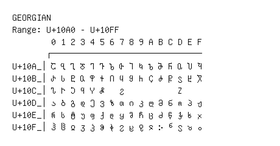

# Georgian

**Range:** `U+10A0` - `U+10FF`

[← Back to Index](../README.md)

```text
        0 1 2 3 4 5 6 7 8 9 A B C D E F
       ┌───────────────────────────────
U+10A_│Ⴀ Ⴁ Ⴂ Ⴃ Ⴄ Ⴅ Ⴆ Ⴇ Ⴈ Ⴉ Ⴊ Ⴋ Ⴌ Ⴍ Ⴎ Ⴏ
U+10B_│Ⴐ Ⴑ Ⴒ Ⴓ Ⴔ Ⴕ Ⴖ Ⴗ Ⴘ Ⴙ Ⴚ Ⴛ Ⴜ Ⴝ Ⴞ Ⴟ
U+10C_│Ⴠ Ⴡ Ⴢ Ⴣ Ⴤ Ⴥ   Ⴧ           Ⴭ
U+10D_│ა ბ გ დ ე ვ ზ თ ი კ ლ მ ნ ო პ ჟ
U+10E_│რ ს ტ უ ფ ქ ღ ყ შ ჩ ც ძ წ ჭ ხ ჯ
U+10F_│ჰ ჱ ჲ ჳ ჴ ჵ ჶ ჷ ჸ ჹ ჺ ჻ ჼ ჽ ჾ ჿ
```

## Visual Fallback Reference
If your system lacks the required fonts to render these characters properly, use the image below as a visual guide.


