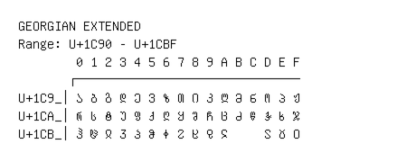

# Georgian Extended

**Range:** `U+1C90` - `U+1CBF`

[← Back to Index](../README.md)

```text
        0 1 2 3 4 5 6 7 8 9 A B C D E F
       ┌───────────────────────────────
U+1C9_│Ა Ბ Გ Დ Ე Ვ Ზ Თ Ი Კ Ლ Მ Ნ Ო Პ Ჟ
U+1CA_│Რ Ს Ტ Უ Ფ Ქ Ღ Ყ Შ Ჩ Ც Ძ Წ Ჭ Ხ Ჯ
U+1CB_│Ჰ Ჱ Ჲ Ჳ Ჴ Ჵ Ჶ Ჷ Ჸ Ჹ Ჺ     Ჽ Ჾ Ჿ
```

## Visual Fallback Reference
If your system lacks the required fonts to render these characters properly, use the image below as a visual guide.


