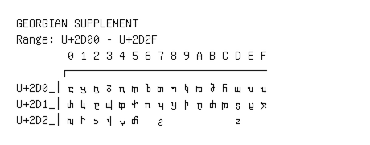

# Georgian Supplement

**Range:** `U+2D00` - `U+2D2F`

[← Back to Index](../README.md)

```text
        0 1 2 3 4 5 6 7 8 9 A B C D E F
       ┌───────────────────────────────
U+2D0_│ⴀ ⴁ ⴂ ⴃ ⴄ ⴅ ⴆ ⴇ ⴈ ⴉ ⴊ ⴋ ⴌ ⴍ ⴎ ⴏ
U+2D1_│ⴐ ⴑ ⴒ ⴓ ⴔ ⴕ ⴖ ⴗ ⴘ ⴙ ⴚ ⴛ ⴜ ⴝ ⴞ ⴟ
U+2D2_│ⴠ ⴡ ⴢ ⴣ ⴤ ⴥ   ⴧ           ⴭ
```

## Visual Fallback Reference
If your system lacks the required fonts to render these characters properly, use the image below as a visual guide.


