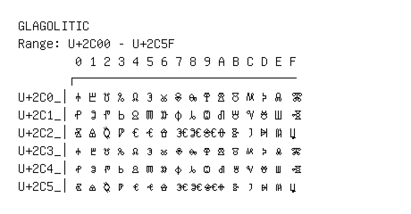

# Glagolitic

**Range:** `U+2C00` - `U+2C5F`

[← Back to Index](../README.md)

```text
        0 1 2 3 4 5 6 7 8 9 A B C D E F
       ┌───────────────────────────────
U+2C0_│Ⰰ Ⰱ Ⰲ Ⰳ Ⰴ Ⰵ Ⰶ Ⰷ Ⰸ Ⰹ Ⰺ Ⰻ Ⰼ Ⰽ Ⰾ Ⰿ
U+2C1_│Ⱀ Ⱁ Ⱂ Ⱃ Ⱄ Ⱅ Ⱆ Ⱇ Ⱈ Ⱉ Ⱊ Ⱋ Ⱌ Ⱍ Ⱎ Ⱏ
U+2C2_│Ⱐ Ⱑ Ⱒ Ⱓ Ⱔ Ⱕ Ⱖ Ⱗ Ⱘ Ⱙ Ⱚ Ⱛ Ⱜ Ⱝ Ⱞ Ⱟ
U+2C3_│ⰰ ⰱ ⰲ ⰳ ⰴ ⰵ ⰶ ⰷ ⰸ ⰹ ⰺ ⰻ ⰼ ⰽ ⰾ ⰿ
U+2C4_│ⱀ ⱁ ⱂ ⱃ ⱄ ⱅ ⱆ ⱇ ⱈ ⱉ ⱊ ⱋ ⱌ ⱍ ⱎ ⱏ
U+2C5_│ⱐ ⱑ ⱒ ⱓ ⱔ ⱕ ⱖ ⱗ ⱘ ⱙ ⱚ ⱛ ⱜ ⱝ ⱞ ⱟ
```

## Visual Fallback Reference
If your system lacks the required fonts to render these characters properly, use the image below as a visual guide.


